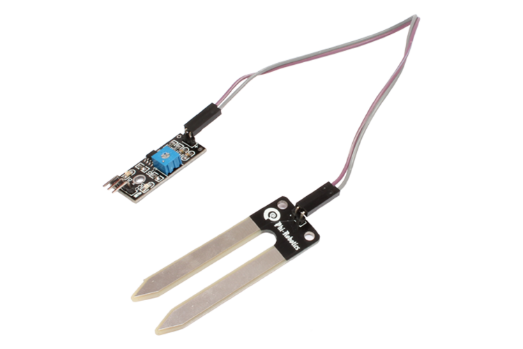
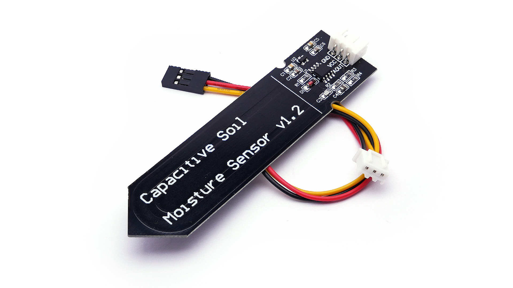
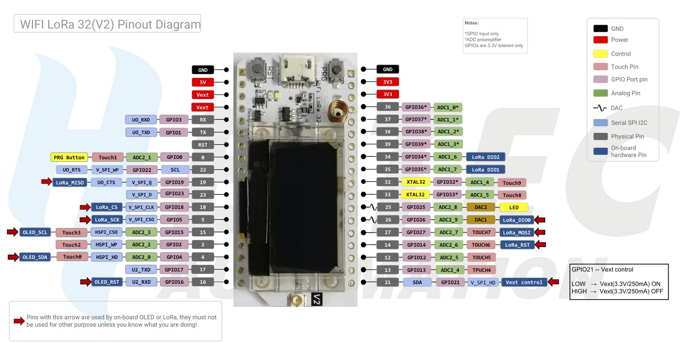

# ReadMe for ESP32LoRa project
*developed by Arseny Starostin and Pieter Geelen*

## Scope
of this project is to do an end-to-end project with a "real-world" application. The use-case is measuring the moisture of the soil a vegetable garden. The architecture should be based on as much "off-shelve" code and hardware and should some what generic, hopefully supporting other projects accordingly. 

## Materials
We use some Heltec ESP32 LoRa v2 modules, some moisture sensors and a Rasperry Pi 4 as our IoT Master (collecting and visualising the data). The Raspberry Pi 4 is outfitter with a WaveShare LoRa HAT. Below is a more specific drilldown of why what materials have been selected:

### Conductive Moisture Sensor
There are various moisture sensors available online and some are better than others. Price-wise sensors can vary from a couple of euros to many hundreds of euros. In the cheap segment, simple corrosive sensors are used. The principle is simple: you pass some current through 2 metal plates. The resistance of the soil is dependent of humidity, the more humid, the less resistance. By measuring the resistance you can therefore measure (indirectly) the humidity. A disadvantage is that this also corrodes the metal plates, eventually dissolving the metal into your soil. Considering that thet application is vegetable garden, and we are unaware of what exact metals are in the corrosive, we prefer a different method. 


The next step up would be capacitive sensors. These sensors come in a variety of forms, from industrial, calibrated and certified sensors to cheap AliExpress variants. The also work on the base of pushing a current through a wire. The difference is that they use this current to ionise the environment. More moisture means more ions and therefore an impact on the current passing through the sensor. The sensor is in direct contact with the soil, and therefore cannot corrode. We selected a cheap 10 euro sensor that contains the probe and the voltage-regulator necessary to 1) push the current through the probe and 2) make it measurable for the micro-controller. We selected this device because it is cost-effective, and what excepted that biggest issue, which is that the sensor is not calibrated. We must therefore measure a MIN and MAX value when ussing muliple sensors to make the comparable. Calibration can also be implemented later in Data-Viz level. 


### ESP32 LoRa Modules
So what is what when it comes to IoT? In our application we need a sensor as outlined above. The sensor with provide "insight" in the form of voltage dropoff. For this reason we need a micro-controller that can 1) provides a 3.3 volt current and 2) Can read out what current comes out of the other side. A micro-controller can do exactly this. More specifically, the read out has to be an analog to digital conversion of the measurement. So to recap, we have a sensor that causes a voltage drop-off that we want to measure. We measure and convert this measurement to a digital value. This digital value usually must be processed in some way. For this reason micro-controllers usually have a small computer connected to it too. With this small computer you can connect consequences to this measurement. For example you can have a light that flashes when the humidity is below a certain threshold. The architecture in that case would be: sensor --> git  to Digital converter --> Computer reading value and activating another micro-controller --> Micro controller gives interrupted current to LED --> Flashing LED. This basic functionality is fundamentally what devices like Arduino are about. This nice thing about Arduino is that it comes with a standard coding framework and a massive Open-Source community supporting it. The costs are also very low, making it accessible to the masses. 

In our specific use-case we want to deploy sensors in a garden. This means that the edges devices need to be supported with off-the-grid power-sources. We aim to achieve this with simple solar-panels and battery-packs. Power-consumption definitely becomes an issue when going down that lane. So appart from us aiming to be able to read a sensor and send it some way, we want to do this in a power efficient way too. Assuming we want a proven and supported platform, we ended up using the Heltec 32 LoRa (v2) board, that has a powerfull enough processor, a battery powermanagment chip, LiPo battery connector and a low power, high range transmission cappability called LoRa. Without going into it too much, it also has features to switch the board on and off on demand to conserve power further. As nice feature, the board also comes with a small OLED screen, which can be usefull for "in-the-field" deployment, particularly for debugging.  


### Host

## IDE 
This project is developed in Visual Studio Code, a free IDE that supports many extensions. We use the plaformio.org extension for programming on our ESP32 modules as it supports a full suite of firmware and libaries. To put simply, platformio takes care of many of "human-errors" that are common with these projects. Please note that this project was developed on Ubuntu 20.04

## Setup
So what do you need to do when cloning this project? Here is a list below:
* Install VS code
* Install platformio.org extension
* Configure serial port
    * Make sure you understand what baudrate is and adjust accordingly with a tool like minicom 
    * Add your user to the dailout group in order to be able to connect to the serial adapter without super-user rights. The command should be: ```sudo adduser $USER dialout``` assuming that you are currently logged in with the user that you want to use for developing the project. 

## Folder Strucure
The repository has the main information in the root directory. Additional documentation can be found in the ```doc``` folder, the individual scripts can be found in the ```projects``` folder. Each project file will have its own ```ReadMe``` file, explaining why certain code was scripted the way it is and what experiences we had. 

go to projects:
* ESP32 LoRa Transmitter [link]
* ESP32 LoRa Receiver [link]
* Raspberry Pi 4 Receiver
* Raspberry Pi "server" script
