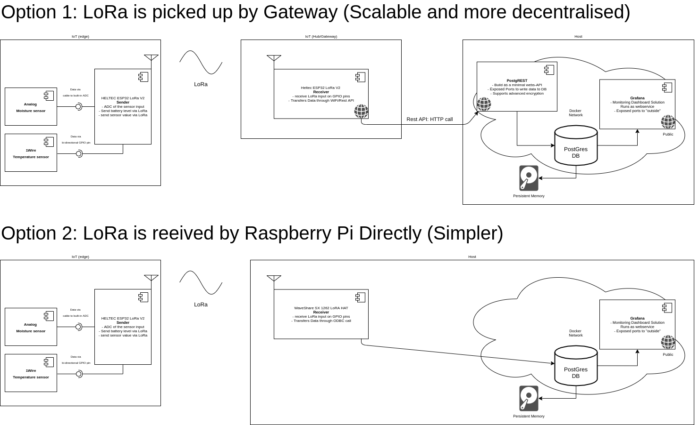

# ReadMe for ESP32LoRa project
*developed by Arseny Starostin and Pieter Geelen*
Trello board: https://trello.com/b/dxxQNYmM/esp32-lora-garden

## Scope
of this project is to do an end-to-end project with a "real-world" application. The use-case is measuring the moisture of the soil a vegetable garden. The architecture should be based on as much "off-the-shelve" code and hardware and should be some what generic, hopefully supporting other projects accordingly. 

## Architecture
The architecture is set up around the functional requirements that we think we need. So firstly we assume that we need a sensor and "something" to read out and transfer these values. The transfer protocol have to be power-efficient in order to work off-grid and does doesn't require large bandwidth capabilities, which led us to selecting LoRa as wireless protocol. The second device is a mere pass-through and transcribes the data from a LoRa-packet to a HTTP-request to the PostgREST API, uploading the data through WiFi connectivity. The receiver can also be integrated into the host when using a local devices, but we found it easier to decouple it first, to get a better understanding off all the components. The advantage of having an intermittant receiver or gateway, is that many sources with multiple, potenitally distant, geographic locations can be integrated without changing the architecture. For industrial applications we suspect this method to be more common place. Lastly, the host is designed around a Docker runtime, that provides its own virtual network, manages a minimal exposure of ports, and uses the local OS only for persistance of the database. This should make the host extremely deployable and reproducable. Docker enables us to deal with the networking as abstract concepts, instead of getting into the mud with all the configuraton that is usually necessary when installing software on an OS. 


## Materials
We use some Heltec ESP32 LoRa v2 modules, some moisture sensor and a Rasperry Pi 4 as our IoT Master (collecting and visualising the data). We also outfitted the Raspberry Pi 4 with a WaveShare LoRa HAT at a later stage to remove the intermittant Gateway. Below is a more specific drilldown of why, what, materials have been selected:

### Conductive Moisture Sensor
There are various moisture sensors available online and some are better than others. Price-wise sensors can vary from a couple of euros to many hundreds of euros. In the cheap segment, simple corrosive sensors are used. The principle is simple: you pass some current through 2 metal plates. The resistance of the soil is dependent on the humidity of the soil: the more humid, the less resistance. By measuring the resistance you can therefore measure (infer) the humidity of the soil. A disadvantage is that this process corrodes the metal plates, eventually dissolving the metal into your soil. Considering that thet application is vegetable garden, and we are unaware of what exact metals are in the corrosive, we prefer a alternate method of infering soil humidity. 


The next step up would be capacitive sensors. These sensors come in a variety of forms, from industrial, calibrated and certified sensors to cheap AliExpress variants. The also work on the basis of pushing a current through a wire. The difference is that they use this current to ionise the environment. More moisture means more ions and therefore an impact on the current passing through the sensor. The sensor is indirect contact with the soil, and therefore cannot corrode. The current itself causes an electro-magnetic field, that can pass through the pastic shielding of the sensor and still interact with the moisture surrounding the sensor. We selected a cheap 5 euro sensor that contains the probe and the voltage-regulator necessary to 1) push the current through the probe and 2) make it measurable for the micro-controller. We selected this device because it is cost-effective, and what excepted that biggest issue, which is that the sensor is not calibrated. We must therefore measure a MIN and MAX value when ussing muliple sensors to make the comparable. Calibration can also be implemented later in Data-Viz level. 


### ESP32 LoRa Modules
So what is what when it comes to IoT? In our application we need a sensor as outlined above. The sensor with provide "insight" in the form of voltage dropoff. For this reason we need a micro-controller that can 1) provides a 3.3 volt current and 2) Can read out what current comes out on the other side. A micro-controller can do exactly this. More specifically, the read out has to be an analog to digital conversion of the measurement. So to recap, we have a sensor that causes a voltage drop-off that we want to measure. We measure and convert this measurement to a digital value. This digital value usually must be processed in some way. For this reason micro-controllers usually have a small computer connected to it too. With this small computer you can program certain logic and connect consequences to this measurement. For example you can have a light that flashes when the humidity is below a certain threshold. The architecture in that case would be: sensor --> to Digital converter --> Computer reading value and activating another micro-controller --> Micro controller gives interrupted current to LED --> Flashing LED. This basic functionality is fundamentally what devices like Arduino are about. The nice thing about Arduino's is that it comes with a standard coding framework and a massive Open-Source community supporting it. The costs are also very low, making it accessible to the masses. 

In our specific use-case we want to deploy sensors in a garden. This means that the edge devices need to be supported with off-the-grid power-sources. We aim to achieve this with simple solar-panels and battery-packs. Power-consumption becomes an issue when going down that lane. So appart from us aiming to be able to read a sensor and send it some way, we want to do this in a power efficient way too. Assuming we want a proven and supported platform, we ended up using the Heltec 32 LoRa (v2) board, that has a powerfull enough processor, a battery powermanagment chip, LiPo battery connector and a low power, high range transmission cappability called LoRa. It is also readily available, as we were able to order it on Amazon. Without going into it too much, it also has features to switch the board on and off on demand to conserve power further. As nice feature, the board also comes with a small OLED screen, which can be usefull for "in-the-field" deployment, particularly for debugging.  


### Host
The host-device can be anything, as long as it fulfills certain requirements. Based on the architecture displayed in the scope section, we want it to run several Docker containers. We are talking about fully fledged programs here, that need a Linux Operating System (OS). Common computers and/or servers would be ample, and we have been testing our setup on a small VM (VPS hosting) that was minimally specced at 1 vCPU, 0.5 GB RAM and 10 GB ROM, costing 1 euro/month at the time of writing. 

Considering that the containers that we want to run, do not only support x86_64 processors, but also ARM-based platforms, we used a Raspberry Pi 4, for a cheap and snappy experience. This new board has awesome power for the buck and can be the beginning of many other projects too. The Raspberry Pi 4 that we chose was the 2 GB RAM edition, that is available for about 40 euros in Europe, and has a Broadcom BCM2711, Quad core Cortex-A72 (ARM v8) 64-bit SoC @ 1.5GHz and dedicated GPU that both can be easily overclocked. It is powerfull enough to do all that we will ask of it, and more! Keep in mind that you should get a serious USB-C powersupply, as the Single Board Computer (SBC) does chew away some amps and not all powersupplies can deliver that consistently. 

If you want to have LoRa connectivity directly on the host, you can use the WaveShare SX1262 LoRa-HAT. The selection of LoRa HATs is sparse when we were browsing the internet. Special attention reached us when we found the SX1262 because at the time of writing this tutorial we found this to have a relatively new LoRa chip and was fairly cheap (35 euros). It could also be purchased from Amazon. Considering we are writing this tutorial in Europe, we purchased the 868 MHz version. Keep in mind the the bandwidth that is allowed is different for the US and Asia! The LoRa HAT is compact and has the footprint of a Raspberry Pi Zero. The documentation was poor at best, but we have figured out how it works and we share our findings here#link.


## IDE 
This project is developed in Visual Studio Code, a free IDE that supports many extensions. We use the plaformio.org extension for programming on our ESP32 modules as it supports a full suite of firmware and libaries. To put simply, platformio takes care of many of the "human-errors" that are common with these projects. It also organises your code into projects, making it scalable and reproducible. A simple platformio.ini file stores all the configurations of your project, making it portable. Please note that this project was developed on Ubuntu 20.04

## Setup
So what do you need to do when cloning this project? Here is a list below:
* Install VS code
* Install platformio.org extension
* Configure serial port
    * Make sure you understand what baudrate is and adjust accordingly with a tool like minicom 
    * Add your user to the dailout group in order to be able to connect to the serial adapter without super-user rights. The command should be: ```sudo adduser $USER dialout``` assuming that you are currently logged in with the user that you want to use for developing the project. 

## Folder Strucure
The repository has the main information in the root directory. Additional documentation can be found in the ```doc``` folder, the individual scripts can be found in the ```projects``` folder. Each project file will have its own ```ReadMe``` file, explaining why certain code was scripted the way it is and what experiences we had. 

go to projects:
* ESP32 LoRa Transmitter [link]
* ESP32 LoRa Receiver [link]
* Raspberry Pi 4 Receiver
* Raspberry Pi "server" script
